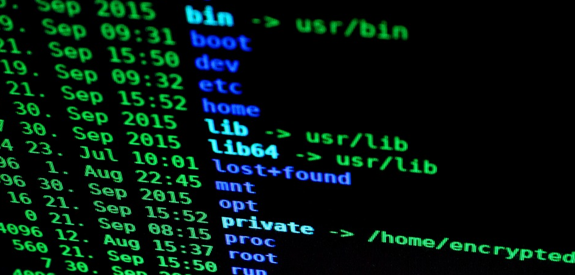
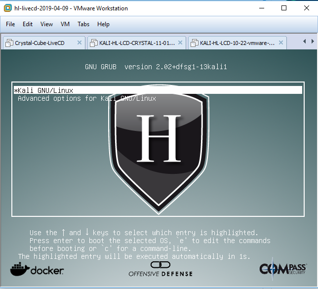
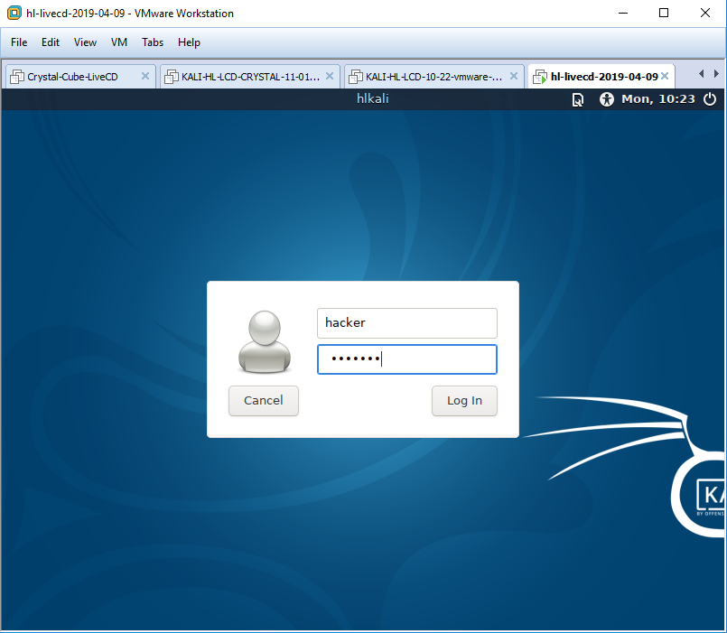
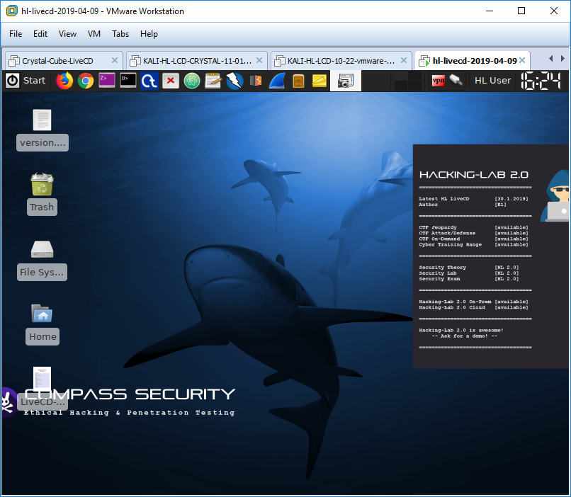
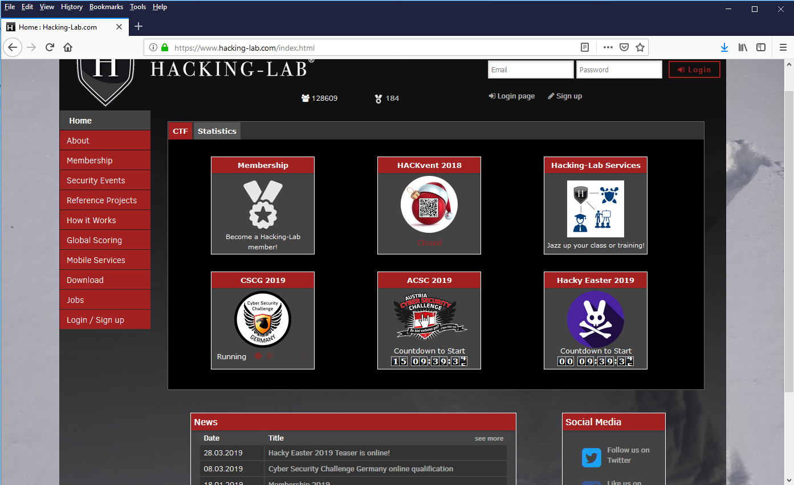
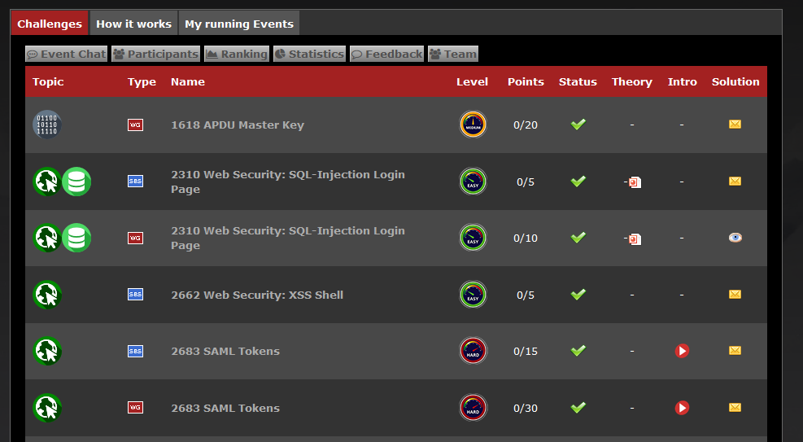

# HWZ Cybersecurity Hacking-Lab
## Einleitung
Dieses Projekt enthält die Workshop Inhalte von Ivan Bütler und Philipp Sieber zum Thema "HWZ Cybersecurity Hacking-Lab". Um sich gegen Hacker schützen zu können, muss man deren Methoden und Vorgehen kennen. Bei diesem Workshop werden aktuelle Hacker Tricks gezeigt und wie man sich dagegen schützen kann. Der Workshop beinhaltet praktische Übungen und wird zusammen mit https://www.hacking-lab.com/ durchgeführt.



## Hacking-Lab LiveCD
Um die praktischen Übungen durchführen zu können, sollten die Teilnehmer die neueste Hacking-Lab LiveCD auf ihren eigenen Laptop installieren. 
Die Installation der LiveCD wird unter folgendem URL im Detail erklärt
* https://github.com/ibuetler/e1pub/tree/master/hacking-lab-livecd-installation

Nach der Installation und dem Start der LiveCD erscheint folgendes Login Fenster (siehe Bild unten)



Für den Login in die LiveCD sind folgende Credentials nötig
```
username    hacker
password    compass
```



Danach erscheint der Desktop der Hacking-Lab LiveCD



## Hacking-Lab Account
Damit man die Aufgaben im Hacking-Lab sehen kann braucht es einen Account im Hacking-Lab. 
Bitte befolgen Sie folgende Schritte:

1. Account auf https://www.hacking-lab.com/ anlegen
2. Nickname sollte "anonymisiert" sein, denn diesen sieht man später auf Hacking-Lab



## Hacking-Lab Event
Während der Vorlesung gibt Ihnen der Teacher noch den `Secret Link` für die Übungen im Hacking-Lab bekannt. 



Nachdem der `Secret Link` angeklickt wurde, erhält man Zugriff für die Hacking-Lab Übungen. 


